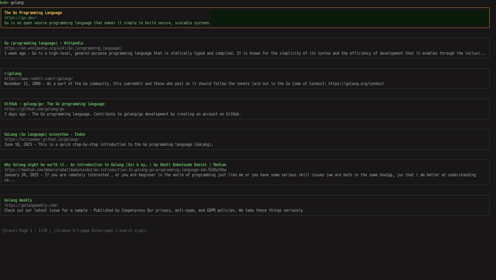

# ksk

[English](README.md)

ターミナルから Web 検索を行う TUI アプリ。検索結果を vim ライクな操作で選択し、ブラウザで開ける。



## インストール

```
go install github.com/frort/ksk@latest
```

またはソースからビルド:

```
git clone https://github.com/frort/ksk.git
cd ksk
go build -o ksk .
```

## 使い方

```
ksk                          # 起動後に検索クエリを入力
ksk "search terms"           # クエリ付きで起動（即検索）
ksk -e brave "search terms"  # Brave で検索
ksk -r jp "search terms"     # 日本の検索結果を取得
ksk -e brave -r de "query"   # Brave + ドイツ
```

### フラグ

| フラグ | デフォルト | 説明 |
|--------|-----------|------|
| `-e` | `duckduckgo` | 検索エンジン (`duckduckgo` / `ddg`, `brave` / `b`) |
| `-r` | _(なし)_ | 国・地域コード (`jp`, `us`, `de`, `fr`, `kr` など) |

### 対応エンジン

| エンジン | エイリアス | 備考 |
|----------|-----------|------|
| DuckDuckGo | `ddg` | デフォルト。`html.duckduckgo.com` の HTML をスクレイピング |
| Brave Search | `b` | `search.brave.com` の HTML をスクレイピング |

## キーバインド

### 結果表示モード

| キー | 動作 |
|------|------|
| `j` / `↓` | 次の結果へ |
| `k` / `↑` | 前の結果へ |
| `g` | 先頭へ |
| `G` | 末尾へ |
| `l` / `→` | 次のページ |
| `h` / `←` | 前のページ |
| `Enter` / `o` | ブラウザで開く |
| `/` | 検索入力 |
| `q` / `Ctrl+C` | 終了 |

### 入力モード

| キー | 動作 |
|------|------|
| `Enter` | 検索実行 |
| `Escape` | 結果表示に戻る |
| `Ctrl+C` | 終了 |

## 関連ツール

- [ddgr](https://github.com/jarun/ddgr) - ターミナルから DuckDuckGo 検索
- [googler](https://github.com/jarun/googler) - ターミナルから Google 検索
- [searxngr](https://github.com/scross01/searxngr) - ターミナルから SearXNG 検索
